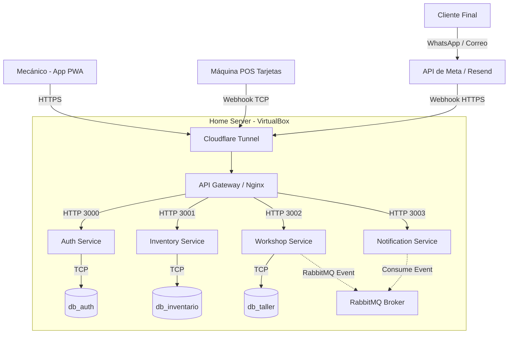

# Arquitectura del Sistema: Backend, Frontend, WhatsApp y Pagos

Este documento describe la arquitectura global, los flujos de datos y el contrato de interfaces (Endpoints y Webhooks) que conectan el ecosistema del Taller Mecánico.

## 1. Arquitectura de Red y Conexiones (Home Server)

El ecosistema está diseñado bajo una arquitectura de microservicios. Todos los componentes se alojan localmente (VirtualBox) y se exponen al exterior mediante un Túnel Zero Trust.



## 2. Flujo de Autenticación y Usuarios (Auth)

Todo acceso a la App PWA pasa por aquí.

### 2.1. Crear Empleado (Solo Admin)
Crea una cuenta para un trabajador.
- **Ruta:** `POST /auth/usuarios`
- **Headers:** `Authorization: Bearer <ADMIN_JWT>`
- **Request Body:**
  ```json
  {
    "nombre": "Carlos Mecánico",
    "correo": "carlos@taller.com",
    "rol": "MECANICO"
  }
  ```
- **Response:** (201 Created) `{"id": 1, "nombre": "Carlos Mecánico", "correo": "..."}`

### 2.2. Recuperación de Contraseña
- **Ruta:** `POST /auth/forgot-password`
- **Request Body:** `{"correo": "carlos@taller.com"}`
- **Response:** (200 OK) `{"message": "Correo de recuperación enviado"}` (Desencadena envío por Nodemailer/Resend).

## 3. Flujo de Taller (Órdenes y Facturación)

### 3.1. Crear Orden de Trabajo
Cuando el mecánico recibe un vehículo.
- **Ruta:** `POST /workshop/ordenes` (Ruta interna gestionada por `workshop-service`).
- **Request Body:**
  ```json
  {
    "vehiculo_id": 123,
    "mecanico_id": "uuid-carlos"
  }
  ```

### 3.2. Cobrar Orden (Integración POS Físico)
Cuando el mecánico presiona el botón "Cobrar" en la PWA.
- **Ruta:** `POST /facturacion/orden/:id/cobrar`
- **Request Body:** `{"metodo_pago": "MERCADOPAGO"}`
- **Response:**
  ```json
  {
    "message": "Máquina POS activada",
    "factura": {
      "id": 45,
      "monto_total": 150.00,
      "estado": "PENDIENTE",
      "external_reference": "POS-ORD-123-17238200"
    }
  }
  ```

### 3.3. Recepción del Pago (Webhook MercadoPago/Transbank)
Las empresas de cobro envían un POST a este endpoint cuando el cliente acerca la tarjeta a la máquina.
- **Ruta:** `POST /facturacion/webhook/pago`
- **Request Body:** (Payload estándar que envía el proveedor)
  ```json
  {
    "external_reference": "POS-ORD-123-17238200",
    "status": "approved"
  }
  ```
- **Acción Interna:** Cambia la orden a `LISTO_PARA_RETIRO` y despacha el evento `estado_vehiculo_actualizado` a RabbitMQ.

## 4. Flujo de Notificaciones y WhatsApp (Notification Service)

### 4.1. Webhook de Recepción de Meta (WhatsApp)
Cuando un cliente escribe al WhatsApp del taller.
- **Ruta:** `POST /webhook/whatsapp`
- **Request Body:** (Estructura propia de la API de Meta Business)
  ```json
  {
    "object": "whatsapp_business_account",
    "entry": [{
      "changes": [{
        "value": {
          "messages": [{
            "from": "56912345678",
            "text": {"body": "Quiero cotizar frenos"}
          }]
        }
      }]
    }]
  }
  ```
- **Flujo Interno:**
  1. El servicio lee el texto ("Quiero cotizar frenos").
  2. Lo envía a la API de OpenAI junto con el catálogo de precios oculto en el System Prompt.
  3. OpenAI devuelve: "¡Hola! El cambio de frenos vale $30".
  4. El servidor dispara una petición HTTP POST a la API oficial de Meta para entregar la respuesta al cliente.

### 4.2. Escucha de Eventos (RabbitMQ)
El `Notification Service` no recibe peticiones HTTP para enviar mensajes salientes. Escucha constantemente la cola de RabbitMQ.
- **Evento:** `estado_vehiculo_actualizado`
- **Payload Interno:** `{"vehiculoId": 12, "estado": "LISTO_PARA_RETIRO", "clienteTelefono": "569..."}`
- **Acción:** Dispara mensaje de WhatsApp al cliente informando que puede retirar su auto.
